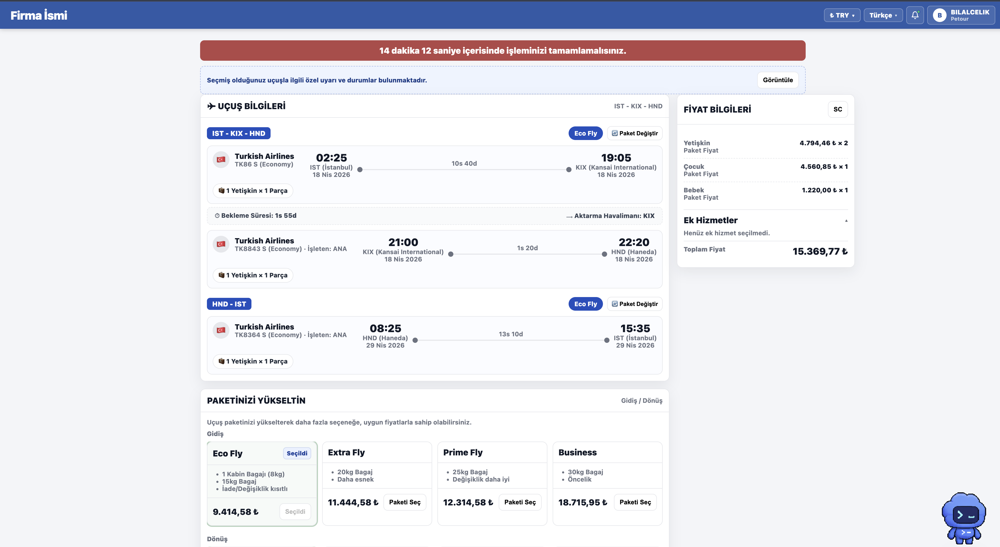

# Product Portfolio

Product case studies and interactive prototypes focused on travel technology, B2B platforms, transactional UX, and API-driven products.

> Portfolio recreation based on professional product-management experience. No proprietary company code, credentials, production logs, or confidential transaction data is included.

## Airline Ancillary Services

### Multi-Provider Retailing & Checkout

The first major case study examines how heterogeneous airline-provider service data can be translated into a consistent, passenger- and segment-aware B2B checkout experience.

[Read the complete product case study](case-studies/airline-ancillary-services/README.md)

### What the project demonstrates

- Multi-provider airline service retailing and checkout design
- Provider response normalization into a canonical service model
- Passenger- and flight-segment-aware service eligibility
- Baggage, meal, and seat-selection experience design
- Cart, pricing, payment, and booking-state coordination
- NDC-aligned Offer and Order concepts with clear claim boundaries
- Story decomposition, acceptance criteria, QA scenarios, and edge-case ownership
- Backend constraints translated into understandable UI behavior

### Try the prototype

[View the preserved HTML demo](airline-ancillary-checkout-demo.html)

GitHub displays HTML source instead of executing it. On the file page, select **Download raw file**, then open the downloaded HTML file in Chrome, Safari, or another browser.

The uploaded demo is the preserved final anonymized version. It has not been rewritten or replaced for this repository. Future iterations will be added as separate versions so the original remains recoverable.

## Planned case studies

Future independent case-study sections may cover:

- B2B agency onboarding
- Booking and checkout state design
- Provider and API integration analysis
- Production incident and log investigation
- Data investigation and query analysis
- Technical product delivery artefacts

Each project will remain separate so its business problem, analysis, decisions, evidence, and outcomes can be evaluated independently.
