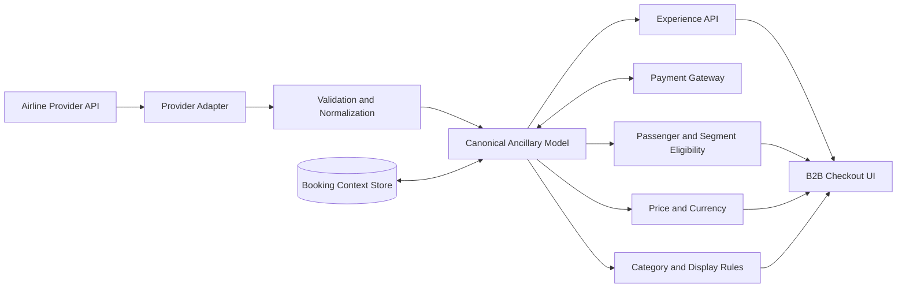
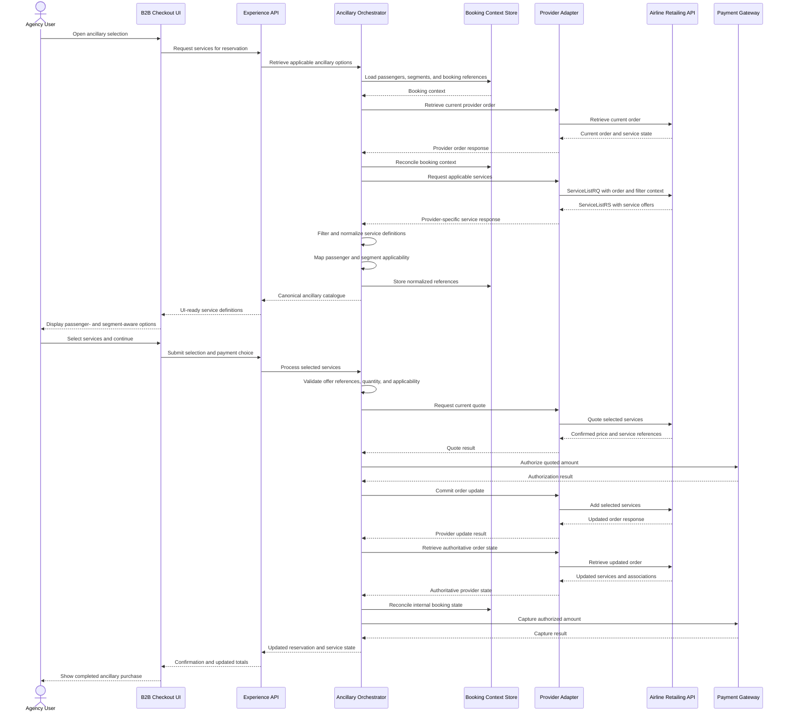
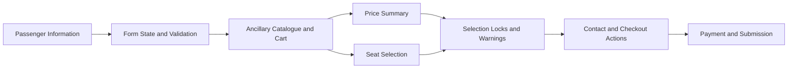
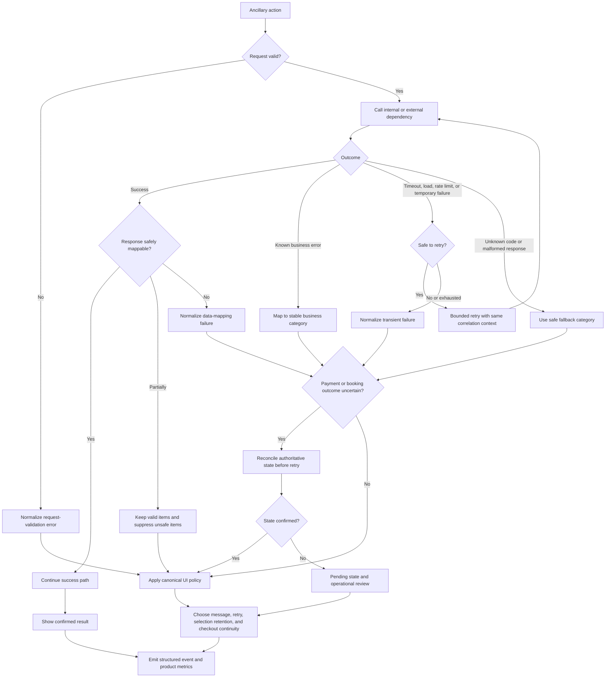

# Airline Ancillary Services

## Multi-Provider Retailing & Checkout

An interactive product case study exploring how heterogeneous airline ancillary content can be transformed into a consistent, passenger- and segment-aware B2B checkout experience.

> Portfolio reconstruction based on professional product-management experience. All company names, internal services, endpoints, identifiers, credentials, production data, and provider-specific contracts have been removed or replaced with generic equivalents.

## Explore the prototype

[View the preserved HTML demo](../../airline-ancillary-checkout-demo.html)

GitHub displays HTML source instead of executing it. Open the file page, select **Download raw file**, and open the downloaded file in a browser. The demo is a self-contained experience prototype using local mock data; it does not call production services.

### Suggested walkthrough

1. Complete or edit passenger information.
2. Explore baggage, meal, and seat options.
3. Filter services by passenger and flight segment.
4. Add and remove options and observe conflict-handling behavior.
5. Review how selections update the cart and price summary.
6. Continue through the checkout states and validation messages.

## The product problem

Selling a fixed catalogue on a single airline storefront is relatively straightforward. A multi-provider travel platform faces a different problem: each airline or provider may expose services with different codes, structures, descriptions, prices, eligibility rules, and levels of detail.

The product challenge was therefore not simply to display a list of extras. It was to define an experience that could:

- absorb provider variation without exposing technical complexity to agency users;
- preserve passenger and flight-segment applicability;
- present baggage, meals, seats, and future service categories consistently;
- keep selection, pricing, payment, and booking state understandable;
- support multi-segment and round-trip journeys without losing context.

## Product perspective

The work connected three distinct models:

1. **Provider model** — external airline-retailing or provider-specific messages.
2. **Canonical platform model** — normalized service definitions, associations, pricing, and source references.
3. **Experience model** — user-facing categories, labels, filters, selection rules, and cart presentation.

[Open the Mermaid source](diagrams/system-context.mmd)

## From backend reality to UX behavior

| Technical or data reality | Product decision | Experience behavior |
|---|---|---|
| Providers can return different codes and content structures | Normalize into shared service categories | Consistent baggage, meal, and seat sections |
| A service may apply to only some travellers | Preserve passenger associations | Passenger-aware filters and service cards |
| Applicability can differ by flight segment | Preserve segment associations | Outbound, inbound, and segment-level context |
| Round-trip and single-direction options may overlap | Define replacement rules | Conflicting selections are updated with feedback |
| Price and availability may change after discovery | Revalidate before commitment | Quote/review step before final submission |
| Seat inventory has spatial and availability constraints | Use a dedicated interaction model | Seat map with occupied, available, selected, and premium states |
| Selected services alter the booking total | Keep price impact visible | Synchronized cart and price summary |
| Traveller data can be required for eligibility | Gate invalid selections | Clear validation and recovery guidance |

## End-to-end ancillary servicing

The following sequence is an anonymized reconstruction of the designed happy path. Component and operation names are functional portfolio labels, not production contracts or a claim of a schema-certified NDC implementation.

[Open the Mermaid source](diagrams/ancillary-servicing-sequence.mmd)

## Delivery decomposition

The experience was decomposed according to behavioral and data dependencies rather than screen sections alone.

[Open the Mermaid source](diagrams/story-dependencies.mmd)

## Key product decisions

- Treat passenger and segment identity as part of every applicable service selection.
- Keep provider codes and structures out of the user-facing information hierarchy.
- Handle overlapping one-way and round-trip choices as explicit replacement behavior.
- Give seats a dedicated interaction model while keeping their price impact inside the same cart.
- Preserve selections while users move between passengers, segments, and service filters.
- Revalidate price and provider references before committing the booking change.
- Separate payment authorization from capture around the provider order update.
- Retrieve the authoritative provider state after mutation before presenting final confirmation.

The reasoning and alternatives are documented in [Product decisions](product-decisions.md).

## Edge cases considered

- incomplete passenger information;
- service not applicable to a selected traveller or segment;
- overlapping single-direction and round-trip options;
- occupied or unavailable seats;
- price or availability changing between discovery and submission;
- provider timeout or empty service catalogue;
- payment authorization failure;
- provider order update failure after authorization;
- payment capture failure after the booking update;
- provider state differing from the local booking state.

The prototype demonstrates selected UX cases. Failure and recovery scenarios not visible in the prototype are documented as **design considerations**, not as implemented production behavior.

## Failure handling and observability

The success path is only part of an ancillary product. The surrounding product contract must also handle invalid outbound parameters, provider timeouts or load-related failures, unknown external responses, missing database mappings, incomplete normalized data, payment errors, and uncertain booking or payment outcomes.

The recommended approach is to translate dependency-specific failures into a canonical error model. That model determines the customer message, retryability, selection retention, checkout continuity, logging severity, and operational follow-up. Raw provider and payment errors should remain outside the user interface.

[Read the failure-handling and observability design](failure-handling-and-observability.md) · [Open the Mermaid source](diagrams/failure-recovery-flow.mmd)

## NDC alignment

IATA NDC 21.3 was used as a reference version for examining the concepts behind service discovery, service definitions, passenger and segment associations, offer items, order servicing, and seat availability. Internal application contracts used their own names and were mapped at the provider boundary.

This case study is **NDC-aligned**, not presented as NDC-certified or schema-validated. See [NDC alignment and scope](ndc-alignment.md).

## Example delivery artefacts

- [Selected acceptance criteria and QA scenarios](acceptance-criteria.md)
- [Product decisions and trade-offs](product-decisions.md)
- [NDC concept alignment](ndc-alignment.md)
- [Failure handling and observability](failure-handling-and-observability.md)
- [Editable Mermaid diagrams](diagrams/)

## Measurement plan

No production performance figures are disclosed or invented. A suitable measurement framework would include:

| Metric | Purpose |
|---|---|
| Ancillary attach rate | Measure adoption among eligible bookings |
| Mapping coverage | Track how much incoming provider content maps cleanly |
| Unmapped-service rate | Detect catalogue gaps and new provider codes |
| Selection failure rate | Identify UX or eligibility friction |
| Quote-change rate | Monitor price/availability changes before commitment |
| Passenger-segment mismatch rate | Detect invalid service associations |
| Provider response latency | Understand discovery and checkout performance |
| Checkout abandonment after interaction | Measure friction introduced by the ancillary step |

## Scope and evidence

| Classification | Meaning in this case study |
|---|---|
| Demonstrated | Visible and interactive in the HTML prototype |
| Modelled | Represented in the prototype's local data and state model |
| Designed | Defined as a product or integration behavior in the reconstructed specification |
| Considered | Recommended edge case or control, not claimed as implemented |
| NDC-aligned | Conceptually mapped to the examined IATA model without certification claims |
