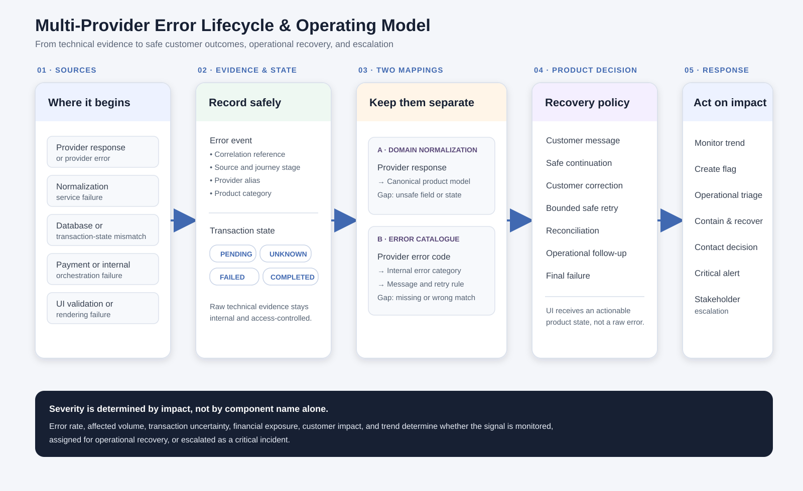

# Multi-Provider Failure Management & Recovery

## Context

This portfolio reconstruction examines how a multi-provider checkout should behave when a dependency, internal transformation, data source, payment step, or interface does not behave as expected.

The purpose is not to expose a technical exception to a customer. It is to turn uncertain technical evidence into a safe customer state, a recoverable operational action, and a traceable product decision.

> This is a clean-room portfolio case study. Provider names, business rules, error codes, records, thresholds, systems, and examples are fictional.

> **Evidence note:** This is a proposed operating model reconstructed from hands-on product experience. It does not represent one production architecture or claim that every control was implemented exactly as shown.

## The product problem

Provider A may complete the same business action that Provider B cannot. A valid Provider B response can also fail while being transformed into the platform's product model. Separately, a provider error code can be missing from, or incorrectly matched to, the platform's error catalogue.

Without explicit design, the result can be a broken screen, an incorrect customer message, an unsafe retry, an unnecessary abandoned checkout, or an incident that is detected too late.

## Product principles

1. A technical cause and a customer message are not the same thing.
2. `failed`, `pending`, and `unknown` are distinct transaction states.
3. A provider-specific limitation must not block an unrelated safe journey.
4. The canonical model represents business meaning, not the easiest provider's response shape.
5. Each error category must define customer guidance, retryability, operational ownership, and escalation conditions.
6. Alerts are based on impact and risk, not merely the presence of an error.

## Two mapping problems, kept separate

| Mapping layer | What can fail | Product consequence |
|---|---|---|
| Response-to-domain normalization | A successful provider response cannot be safely converted into the canonical product model | Suppress only the unsafe item or state; preserve the rest of the safe journey |
| Provider-error-to-product-error mapping | A provider error code has no catalogue entry or is mapped to the wrong internal category | The customer can receive the wrong message, retry rule, or next action |

Read [Response and error mapping](response-and-error-mapping.md) for the detailed distinction.

## Error lifecycle and operating model

The model separates technical evidence from the customer experience. Successful provider data follows response-to-domain normalization; provider error codes follow the error-catalogue path. Both feed product recovery rules, operational monitoring, and impact-based escalation.

## Illustrative recovery scenario

Provider B returns a valid response, but an unexpected service attribute cannot be normalized. The platform must not render a partial option as purchasable. It records a `DOMAIN_MAPPING_GAP`, hides the affected option, preserves eligible alternatives, and flags the gap for review.

If Provider B instead returns an error code that is unknown to the catalogue, the platform uses a safe fallback category. It does not tell the customer to correct their input unless that conclusion is supported. The unknown code is retained as evidence for a mapping decision.

## Recovery decision order

1. Classify the technical source and the product impact.
2. Determine whether the transaction outcome is final or uncertain.
3. Reconcile uncertain outcomes against the authoritative state before allowing resubmission, confirmation, or reversal.
4. Prefer safe continuation when only an optional item or provider-specific capability is affected.
5. Ask the customer to correct an input only when the evidence shows that the customer can resolve the problem.
6. Retry only when the action is idempotent, transient, and within the permitted retry budget.
7. Create operational follow-up when no safe self-service route exists.
8. Present final failure only after the available evidence confirms that recovery is not possible.

## Case-study artefacts

- [Error taxonomy](error-taxonomy.md)
- [Response and error mapping](response-and-error-mapping.md)
- [Monitoring and escalation design](monitoring-and-escalation.md)
- [Acceptance criteria](acceptance-criteria.md)
- [Error lifecycle and operating model](diagrams/error-lifecycle-operating-model.svg)

## What this demonstrates

- Provider-neutral product-state design
- Error-catalogue and canonical-model governance
- Safe customer messaging and recovery paths
- Operational observability and impact-based alerting
- Product ownership across provider, platform, data, payment, and UI boundaries
