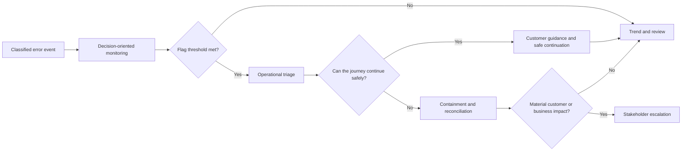

# Monitoring and Escalation Design

## Decision-oriented monitoring

The monitoring view answers operational questions rather than exposing raw technical output:

- Is the error rate rising, and in which journey stage?
- Is the problem isolated to one provider alias, region, partner segment, or user type?
- Is the failure caused by the provider, normalization, error catalogue, internal state, payment, or UI?
- Can affected customers safely continue, or are transactions uncertain?
- Does the pattern require review, containment, or senior stakeholder visibility?

## Logical records and responsibilities

This case describes logical responsibilities rather than prescribing a specific reporting or monitoring tool.

| Record or component | What it holds | What it must not expose broadly |
|---|---|---|
| Error event store | Synthetic correlation reference, source, journey stage, provider alias, internal category, occurrence time, and retry count | Credentials, unrestricted payloads, personal data, or raw database messages |
| Transaction-state record | The current authoritative product state such as `pending`, `unknown`, `failed`, or `completed` | A guessed final state derived only from a timeout |
| Error catalogue | Provider error code and context mapped to an internal category, approved customer-message key, retry rule, owner, and escalation policy | Raw provider messages presented directly to customers |
| Monitoring aggregation | Counts, rates, trends, affected scope, unresolved uncertain outcomes, and severity inputs | Unnecessary transaction-level personal details |
| Operational work item | Correlation reference, current state, evidence category, owner, next check, and customer-contact decision | Broadly accessible raw technical evidence |

The responsibilities are deliberately separated:

1. Source services emit structured error evidence without deciding the customer message.
2. Classification applies the technical source and product-impact category.
3. The error catalogue supplies the approved message, retry, ownership, and escalation rules.
4. Monitoring rules evaluate recurrence, affected volume, uncertainty, financial exposure, and trend.
5. The alerting layer raises a flag at the appropriate severity.
6. Operations owns transaction-level recovery; stakeholder notification is reserved for material impact.

## Synthetic dashboard measures

| Measure | Decision supported |
|---|---|
| Attempts, successful outcomes, final failures, pending/unknown outcomes | Assess customer and commercial impact |
| Error rate by provider alias and stage | Distinguish provider-specific regressions from broad platform issues |
| Domain-mapping gap rate | Detect unsupported provider behaviour or canonical-model coverage gaps |
| Unknown error-code rate | Detect catalogue coverage gaps and contract change risk |
| Retry outcome rate | Confirm retries recover value rather than create repeated friction |
| Continuation-without-service rate | Detect revenue or experience impact from safely degraded journeys |
| Unresolved uncertain transactions | Prioritize reconciliation and customer follow-up |

## Flag and escalation policy

| Level | Example trigger | Expected action |
|---|---|---|
| Monitor | Isolated, low-impact mapping or validation error | Trend the signal and create a reviewed backlog item |
| Investigate | Meaningful increase for a provider alias, region, channel, or journey stage | Product and technical triage; validate the source and customer impact |
| Critical | Payment/order result uncertain, duplicate-action risk, or broad checkout degradation | Immediate containment, incident ownership, and reconciliation plan |
| Stakeholder escalation | Sustained material customer, revenue, or operational impact | Concise impact, containment status, and decision-needed update to relevant business stakeholders |

Alerts use a combination of error rate, affected transaction volume, uncertainty, financial risk, and trend. A single error does not automatically become an incident; nor should a low-volume but high-risk uncertain payment result wait for a volume threshold.

## From signal to action

## Operational follow-up

For a transaction that cannot safely self-recover, an operational work item has a synthetic correlation reference, current product state, evidence category, owner, next check, and customer-contact decision. Its resolution can be safe continuation, a corrected customer action, reconciliation, or confirmed final failure. This enables controlled follow-up without exposing raw logs or sensitive records in broad dashboards.
